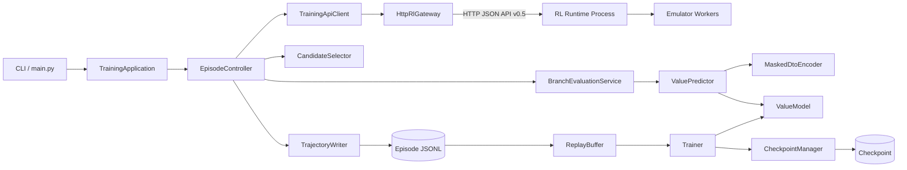
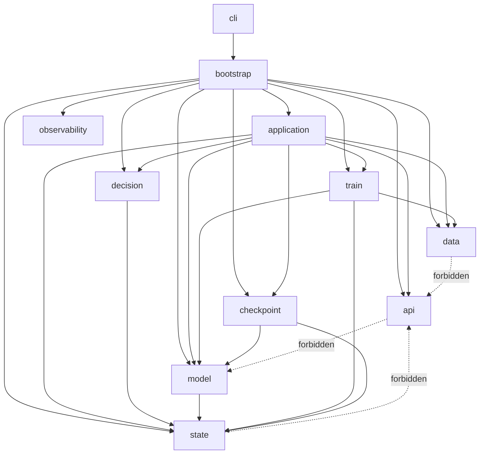
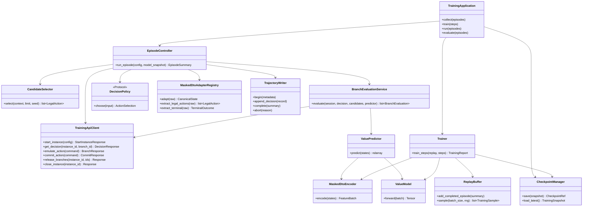
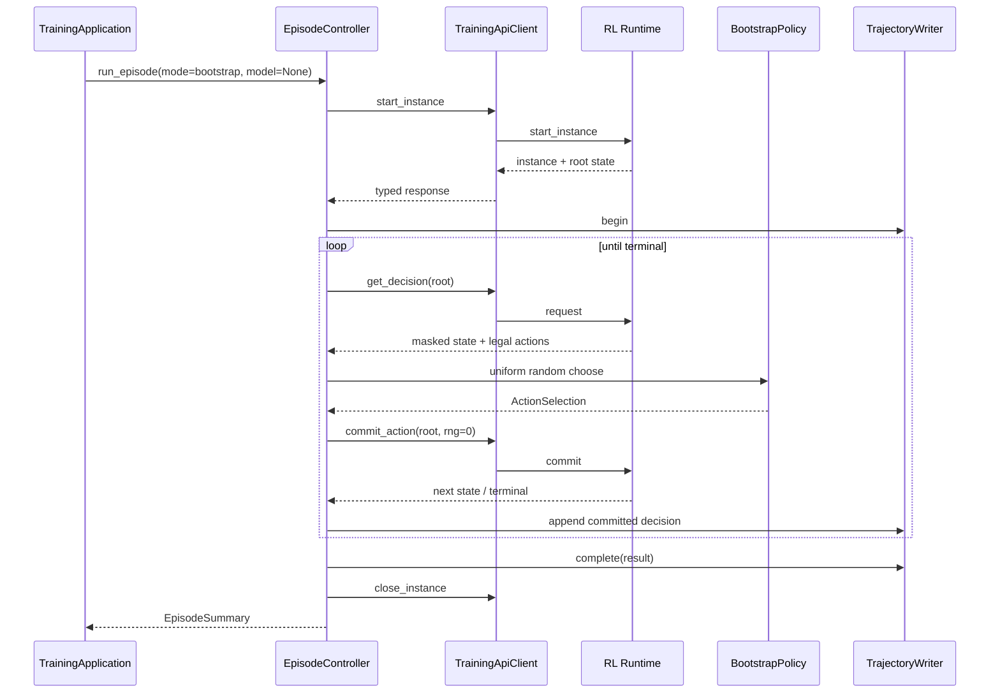
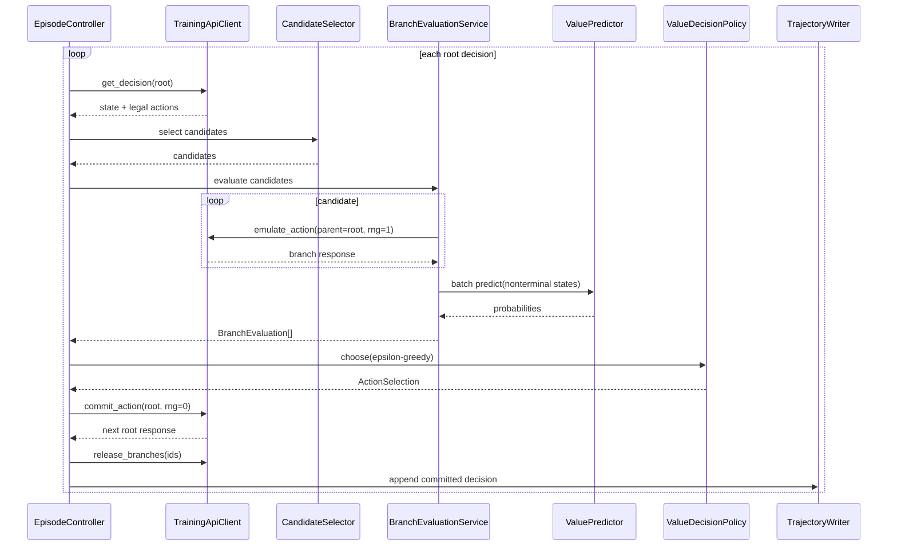

# STS2_Training 詳細設計書 v1.0

- 文書状態: 実装開始用 Draft
- 作成日: 2026-08-04
- 対象: `STS2_Training` 初期実装
- 通信契約: RL–Training Communication API v0.5
- 基礎資料:
  - `rl_training_dto_documentation_v0_5(3).md`
  - `training_minimal_design_v0_1(3).md`

---

## 0. 文書の目的

本書は、`STS2_Training` を実装可能な粒度まで具体化する。

特に、次を確定する。

1. 使用言語、外部ライブラリ、依存関係管理方法
2. Training Process と RL Runtime 間の通信方式
3. Repository／Package／File構成
4. Class、Protocol、DTO、内部Domain Modelの責務と依存関係
5. Value Modelの入力、Network構成、学習方式
6. Episode、Replay、Checkpointの保存形式
7. Retry、Fault、Cleanup、再現性の規則
8. Unit／Integration／E2E Testの境界

本書はTraining側だけを対象とする。RL Runtime、Emulator Worker、Snapshot、Replay、Lease、RNG内部状態の実装は対象外であり、TrainingはRL–Training API v0.5を介してのみ操作する。

---

## 1. 基礎資料から継承する制約

以下は本設計でも変更しない。

- Trainingを判断主体、RLを実行主体とする。
- rootは`branch_id="root"`、`rng_id=0`であり、`commit_action`だけで進行する。
- Branchは`emulate_action`で作成し、rootまたは親Branchを変更しない。
- Simulation結果をrootへ移植せず、採用Actionをroot上で再実行する。
- TrainingはSnapshot、Worker、Lease、Replay、RNG内部状態を直接操作しない。
- Model入力には`masked_emulator_dto`だけを使用し、Hidden Informationを補完または推測しない。
- 初期版のModelは状態価値のみを予測し、Policy Headを持たない。
- 教師値は完了したroot Runの勝敗だけを使用する。
- Branch到達状態へ疑似Labelを付けない。
- 1 Episode中はModel Versionを変更しない。
- 初期版は1 Training Process・1 RL instance・1 Episode逐次実行とする。
- Bootstrap ModeではBranch評価を行わない。
- Value-Guided Modeでは候補Branchをまとめて1 Batchで推論する。

---

## 2. 本書で新たに確定する設計判断

| 項目 | 決定 |
|---|---|
| 実装言語 | Python 3.12 |
| Package管理 | `uv` + `pyproject.toml` + commit済み`uv.lock` |
| Source layout | `src/sts2_training/` layout |
| RL通信Transport | HTTP/1.1 + UTF-8 JSON、単一execute endpoint |
| API DTO Validation | Pydantic v2、`extra="forbid"`、operation discriminator |
| JSON codec | `orjson` |
| HTTP client | `httpx.Client`の同期Client |
| 内部Domain Model | `dataclasses.dataclass(frozen=True, slots=True)` |
| Model／学習 | PyTorch |
| 数値処理 | NumPy |
| 評価指標 | scikit-learn + 独自ECE実装 |
| Raw Episode | 監査用JSONL、Episodeごとに1 file |
| Replay索引 | Python標準`sqlite3`によるmetadata catalog |
| Config | TOML + Pydantic validation + `STS2_TRAINING__...`環境変数上書き |
| Checkpoint | version directory + manifest + completion marker + atomic `LATEST` pointer更新 |
| Logging | Python標準`logging`、JSON Lines出力 |
| CLI | Python標準`argparse` |
| Test | pytest、pytest-cov、Hypothesis、HTTPX MockTransport |
| 型検査／Lint | mypy strict、Ruff |
| Dependency Injection | DI frameworkを使わず`bootstrap.py`で明示的に構築 |
| 非同期処理 | 初期版では使用しない |

### 2.1 TransportをHTTP JSONに固定する理由

RL–Training DTO v0.5はoperation付きRequest／Response envelopeとして定義されているため、単一endpointへJSONをPOSTする方式と整合する。Training Processはpythonnet／CLRを初期化せず、RL Runtimeを別Processとして扱う。

将来Transportを変更できるよう、Application層は`RlGateway` Protocolにだけ依存する。初期実装は`HttpRlGateway`を使用する。

### 2.2 同期Clientを採用する理由

初期版は1 Episodeを逐次実行し、Branch要求も順番に送る。非同期化してもTraining側の複雑性が増える一方、RL Runtime側のWorker並列度やQueue契約が未確定である。したがって初期版では同期実装とし、並列Actor導入時に`AsyncRlGateway`を追加する。

---

## 3. 品質目標

### 3.1 Correctness

- staleな`decision_point_id`を再利用しない。
- Actionは必ず現在の`legal_actions`に含まれる`action_id`をそのまま返す。
- `rejected`時にroot進行済みとして記録しない。
- `request_id`再送時にRequest bodyを変更しない。
- Branch stateを学習Labelとして使用しない。
- 未対応`dto_version`／`mask_version`を黙って処理しない。

### 3.2 Reproducibility

同一の次の入力から、CommitするAction列を再現できることを目標とする。

- Run Seed
- Training Master Seed
- Config digest
- Model Version
- Encoder／Vocabulary Version
- RL Runtime Version
- RL–Training schema version

Request IDや時刻は同一である必要はない。

### 3.3 Recoverability

- API timeout後は同一`request_id`で安全に再送できる。
- 未完了Episode fileをReplayへ混入させない。
- 不完全Checkpointを`LATEST`として採用しない。
- 前回正常Checkpointから学習・推論を再開できる。
- Episode終了または異常終了時にBranchとinstanceをcleanupする。

### 3.4 Auditability

- root Decisionのraw `masked_emulator_dto`を変更せず保存する。
- 候補選択、Branch score、探索乱数、Fallback理由を記録する。
- Model／Config／Vocabulary／Feature statisticsの対応をCheckpoint manifestで追跡する。

---

## 4. 技術スタック

## 4.1 Runtime Library

| Library | 用途 | 採用範囲 |
|---|---|---|
| `torch` | Value Model、Optimizer、Batch inference、training | Model／train packageだけ |
| `numpy` | Training RNG、配列処理、metric前処理 | decision／train／data |
| `pydantic` | API DTO、Config、保存metadataの境界Validation | api／config／data metadata |
| `httpx` | RL Runtimeへの同期HTTP通信 | api/transportだけ |
| `orjson` | API JSON、JSONL、stable canonical JSON | api／data／observability |
| `scikit-learn` | Log Loss、Brier、ROC-AUC | train/metricsだけ |

Python標準ライブラリとして次を使用する。

- `argparse`: CLI
- `dataclasses`: 内部immutable model
- `sqlite3`: Replay catalog
- `tomllib`: Config読込
- `logging`: Log
- `hashlib`: state/config/file digest
- `uuid`: Request ID／Branch ID
- `pathlib`: path handling
- `signal`: graceful shutdown
- `os.replace`: atomic pointer/file replacement
- `contextlib`: cleanup scope

## 4.2 Development Library

| Library | 用途 |
|---|---|
| `pytest` | Unit／Integration Test |
| `pytest-cov` | Coverage |
| `hypothesis` | DTO、candidate selection、samplingのproperty test |
| `mypy` | strict static type check |
| `ruff` | lint／format／import sorting |

HTTP mock専用libraryは追加せず、`httpx.MockTransport`を使用する。

## 4.3 Version Policy

`pyproject.toml`では互換Major範囲を指定し、`uv.lock`で実際の全transitive dependencyを固定する。

基準例:

```toml
requires-python = ">=3.12,<3.14"

dependencies = [
  "torch>=2.13,<3",
  "numpy>=2,<3",
  "pydantic>=2.13,<3",
  "httpx>=0.28,<1",
  "orjson>=3.10,<4",
  "scikit-learn>=1.6,<2",
]
```

CUDA wheelはDeployment profileで選択する。RepositoryのModel codeはCPU／CUDAで共通とし、CUDA versionはAzure VM image決定後にlockする。

## 4.4 初期版で使用しないLibrary

- FastAPI: TrainingはServerではない。
- Requests: timeout分類とClient abstractionのためHTTPXへ統一する。
- Tenacity: 同一Request body／request_id再送を厳密に管理するため、小さい専用Retry実装を持つ。
- Hydra: Config階層が初期版では小さい。
- pandas／PyArrow: Raw Episodeと初期Replay規模では不要。
- Ray／Celery: 分散Actorは対象外。
- TensorBoard／Weights & Biases: 初期版はJSONL metricで十分。
- pythonnet: 受け入れ条件上、Training Processでは禁止する。

---

## 5. System Context



### 5.1 Process Boundary

Training Process内にCLR、Godot、Emulator assemblyをloadしてはならない。RL Runtimeとの境界はHTTP DTOだけとする。

### 5.2 Layer Boundary

```text
entrypoint
   ↓
application
   ↓
domain / ports
   ↓
adapters (api, persistence, model runtime)
```

依存方向は常に内側へ向ける。

- `domain`はPydantic、HTTPX、SQLite、Torchへ依存しない。
- `application`はHTTPやfile formatの詳細へ依存しない。
- `api`はModelやReplayへ依存しない。
- `model`はRL API DTOへ直接依存せず、`CanonicalState`／`FeatureBatch`だけを受け取る。
- `train`はraw `masked_emulator_dto`を直接解釈しない。

---

## 6. RL–Training HTTP Transport

## 6.1 Endpoint

初期Transportは次に固定する。

```text
POST /rl-training/v0.5/execute
Content-Type: application/json; charset=utf-8
Accept: application/json
```

Request bodyはRL–Training API v0.5 Requestそのものとする。OperationごとにURLを分割しない。

Operational endpointとして次を許可するが、TrainingのEpisode進行には使用しない。

```text
GET /healthz
```

## 6.2 HTTP Status Rule

- HTTP 200: Protocol levelでは処理済み。`status`は`completed`、`partial`、`rejected`、`faulted`等を取り得る。
- HTTP 400: JSON構文、Content-Type、transport envelope不正。
- HTTP 404: endpoint/version不一致。
- HTTP 409: Server側request-id cacheの重大な競合。通常はprotocol `rejected`を優先する。
- HTTP 429／503: 同一`request_id`でretry可能。
- HTTP 500系: 実行結果不明として同一`request_id`でretryする。

## 6.3 Timeout

`httpx.Timeout`を明示設定する。

| 種別 | 初期値 |
|---|---:|
| connect | 5 s |
| write | 5 s |
| pool | 5 s |
| read | operation別 |

- 通常operation: 30 s
- `emulate_action`: `max_time_ms / 1000 + 10 s`、最低30 s
- timeout無効化は禁止する。

## 6.4 Retry

Retry対象:

- ConnectError
- ConnectTimeout
- ReadTimeout
- WriteError
- HTTP 429
- HTTP 502／503／504

Retryしない対象:

- Pydantic validation error
- HTTP 400／404
- Protocol `rejected`
- 内容が異なるrequest-id conflict

初期値:

```text
max_attempts = 3
backoff = 0.25s, 0.75s, 2.0s
```

最重要規則:

1. Retry loop開始前に`request_id`を1回だけ発行する。
2. Pydantic modelをcanonical JSON bytesへ1回だけserializeする。
3. 全attemptで同じbytesを送る。
4. Responseの`request_id`、`operation`、`schema_version`一致を検証する。

## 6.5 Client State

元の最小設計では`TrainingApiClient`がinstanceやdecision stateを保持するとしていたが、本詳細設計ではmutableなEpisode stateを`EpisodeSession`へ分離する。

理由:

- API clientを複数Episode間で安全に再利用できる。
- stale decisionの更新箇所をEpisodeControllerへ限定できる。
- Test時にProtocol通信とEpisode状態遷移を分離できる。

`TrainingApiClient`が保持するのはconnection pool、codec、retry policy、ID factoryだけである。

---

## 7. Repository／File構成

```text
STS2_Training/
├─ pyproject.toml
├─ uv.lock
├─ README.md
├─ LICENSE
├─ .python-version
├─ .gitignore
├─ configs/
│  ├─ training.default.toml
│  ├─ training.bootstrap.toml
│  ├─ training.value_guided.toml
│  └─ evaluation.toml
├─ docs/
│  ├─ STS2_Training_detailed_design_v1_0.md
│  ├─ protocol_notes.md
│  └─ data_format.md
├─ src/
│  └─ sts2_training/
│     ├─ __init__.py
│     ├─ __main__.py
│     ├─ bootstrap.py
│     ├─ config.py
│     ├─ errors.py
│     ├─ version.py
│     │
│     ├─ api/
│     │  ├─ __init__.py
│     │  ├─ client.py
│     │  ├─ gateway.py
│     │  ├─ http_gateway.py
│     │  ├─ protocol.py
│     │  ├─ codec.py
│     │  ├─ ids.py
│     │  └─ retry.py
│     │
│     ├─ application/
│     │  ├─ __init__.py
│     │  ├─ training_application.py
│     │  ├─ episode_controller.py
│     │  ├─ branch_evaluation_service.py
│     │  ├─ lifecycle.py
│     │  └─ session.py
│     │
│     ├─ decision/
│     │  ├─ __init__.py
│     │  ├─ candidate_selector.py
│     │  ├─ policy.py
│     │  ├─ bootstrap_policy.py
│     │  ├─ value_policy.py
│     │  └─ exploration.py
│     │
│     ├─ state/
│     │  ├─ __init__.py
│     │  ├─ canonical.py
│     │  ├─ legal_action.py
│     │  ├─ adapter.py
│     │  ├─ adapter_registry.py
│     │  ├─ encoder.py
│     │  ├─ feature_batch.py
│     │  ├─ normalization.py
│     │  └─ vocabulary.py
│     │
│     ├─ model/
│     │  ├─ __init__.py
│     │  ├─ value_model.py
│     │  ├─ modules.py
│     │  ├─ predictor.py
│     │  └─ model_snapshot.py
│     │
│     ├─ data/
│     │  ├─ __init__.py
│     │  ├─ trajectory.py
│     │  ├─ trajectory_writer.py
│     │  ├─ episode_reader.py
│     │  ├─ replay_buffer.py
│     │  ├─ replay_catalog.py
│     │  ├─ split.py
│     │  └─ schema.py
│     │
│     ├─ train/
│     │  ├─ __init__.py
│     │  ├─ trainer.py
│     │  ├─ dataset.py
│     │  ├─ sampler.py
│     │  ├─ evaluator.py
│     │  └─ metrics.py
│     │
│     ├─ checkpoint/
│     │  ├─ __init__.py
│     │  ├─ manager.py
│     │  ├─ manifest.py
│     │  └─ integrity.py
│     │
│     ├─ observability/
│     │  ├─ __init__.py
│     │  ├─ log_config.py
│     │  ├─ json_formatter.py
│     │  └─ run_metrics.py
│     │
│     └─ cli/
│        ├─ __init__.py
│        ├─ parser.py
│        └─ commands.py
│
├─ tests/
│  ├─ unit/
│  │  ├─ api/
│  │  ├─ decision/
│  │  ├─ state/
│  │  ├─ model/
│  │  ├─ data/
│  │  ├─ train/
│  │  └─ checkpoint/
│  ├─ integration/
│  │  ├─ test_api_client_contract.py
│  │  ├─ test_episode_persistence.py
│  │  ├─ test_checkpoint_roundtrip.py
│  │  └─ test_training_resume.py
│  ├─ e2e/
│  │  ├─ test_bootstrap_combat.py
│  │  ├─ test_bootstrap_whole_run.py
│  │  ├─ test_value_guided_combat.py
│  │  └─ test_value_guided_whole_run.py
│  ├─ fixtures/
│  │  ├─ protocol/
│  │  ├─ masked_dto/
│  │  └─ episodes/
│  └─ conftest.py
│
├─ var/                         # gitignore
│  ├─ data/
│  │  ├─ episodes/
│  │  ├─ replay.sqlite3
│  │  └─ quarantine/
│  ├─ checkpoints/
│  ├─ logs/
│  └─ runs/
│
└─ scripts/
   ├─ smoke_local.ps1
   ├─ smoke_local.sh
   └─ verify_repository.py
```

### 7.1 File配置規則

- 1 file 1主要classを原則とする。
- DTO群は循環importを避けるため`api/protocol.py`へまとめてよい。
- `__init__.py`から大量の再exportを行わない。
- Runtime pathをsource tree配下へ置かない。
- `var/`は全てgitignoreし、fixtureだけを`tests/fixtures/`へcommitする。
- Configの秘密値はTOMLへ保存せず環境変数で指定する。

---

## 8. Package依存規則



禁止事項:

- `model`から`api.protocol`をimportしない。
- `state`からHTTP clientをimportしない。
- `decision`からfile I/Oを行わない。
- `Trainer`からRL APIを呼ばない。
- `TrajectoryWriter`からValue Modelを呼ばない。
- class間連携のためのmodule-level mutable globalを置かない。

---

## 9. 全体Class関係



---

## 10. API Package詳細

## 10.1 `api/protocol.py`

Pydantic ModelでRL–Training API v0.5を表現する。

共通設定:

```python
ConfigDict(
    extra="forbid",
    frozen=True,
    strict=True,
    validate_assignment=True,
)
```

文字列Enumは`StrEnum`を使用する。

主要型:

```python
class Operation(StrEnum):
    START_INSTANCE = "start_instance"
    GET_DECISION = "get_decision"
    COMMIT_ACTION = "commit_action"
    EMULATE_ACTION = "emulate_action"
    CANCEL_BRANCHES = "cancel_branches"
    RELEASE_BRANCHES = "release_branches"
    GET_BRANCH_STATUS = "get_branch_status"
    CLOSE_INSTANCE = "close_instance"

class Status(StrEnum):
    COMPLETED = "completed"
    PARTIAL = "partial"
    QUEUED = "queued"
    RUNNING = "running"
    CANCELLED = "cancelled"
    REJECTED = "rejected"
    FAULTED = "faulted"
    RELEASED = "released"
```

Requestはoperation discriminatorを使ったUnionとする。

```python
ApiRequest = Annotated[
    StartInstanceRequest
    | GetDecisionRequest
    | CommitActionRequest
    | EmulateActionRequest
    | CancelBranchesRequest
    | ReleaseBranchesRequest
    | GetBranchStatusRequest
    | CloseInstanceRequest,
    Field(discriminator="operation"),
]
```

`masked_emulator_dto`は公式schema fileが提供されるまでは`dict[str, JsonValue]`としてenvelopeへ保持する。ただしModelへ渡す前に`MaskedDtoAdapter`がversion別にfail-closed validationする。

### 10.1.1 Cross-field Validation

各Request Modelで次を検証する。

- `commit_action.branch_id == "root"`
- `commit_action.rng_id == 0`
- `emulate_action.branch_id != "root"`
- `emulate_action.rng_id > 0`
- `branch_ids`は空配列不可、重複不可
- `max_depth`、`max_steps`、`max_time_ms`、`max_hypotheses`は正数
- `schema_version == "0.5"`

Response Validatorで次を検証する。

- `rejected`／`faulted`では`error`必須
- `faulted`では`fault_kind`必須
- `completed`／`partial`で状態が期待されるoperationは`masked_emulator_dto`必須
- `request_id`、`operation`はRequestと一致
- `schema_version`はClient対応versionと一致

## 10.2 `api/gateway.py`

```python
class RlGateway(Protocol):
    def execute(self, request_bytes: bytes, *, timeout_s: float) -> bytes: ...
    def close(self) -> None: ...
```

Gatewayはbytes単位とし、Pydanticやoperation semanticsを持たない。

## 10.3 `api/http_gateway.py`

```python
@dataclass(slots=True)
class HttpRlGateway:
    base_url: str
    client: httpx.Client
    execute_path: str = "/rl-training/v0.5/execute"

    def execute(self, request_bytes: bytes, *, timeout_s: float) -> bytes: ...
    def close(self) -> None: ...
```

設定:

- `http2=False`
- `trust_env=False`をdefaultとする。明示設定時だけproxyを許可する。
- connection poolをEpisode間で再利用する。
- response body最大sizeをConfigで制限する。初期16 MiB。
- non-JSON bodyは`TransportProtocolError`とする。

## 10.4 `api/codec.py`

```python
class ProtocolCodec:
    def encode_request(self, request: ApiRequest) -> bytes: ...
    def decode_response(self, raw: bytes) -> ApiResponse: ...
    def canonical_digest(self, raw: bytes) -> str: ...
```

`orjson` option:

- `OPT_SORT_KEYS`
- timezoneはUTC ISO-8601
- NaN／Infinityは禁止

API body digestをRequest attempt logへ記録する。

## 10.5 `api/ids.py`

```python
class RequestIdFactory:
    def new(self) -> str: ...  # req-<uuid4 hex>

class BranchIdFactory:
    def new(self, episode_id: str, step: int, candidate_index: int) -> str: ...
```

Branch IDはinstance内生涯一意である必要があるため、UUID suffixを含める。

```text
br-<episode-short>-s000123-c03-<uuid8>
```

## 10.6 `api/retry.py`

```python
@dataclass(frozen=True, slots=True)
class RetryPolicy:
    max_attempts: int
    delays_s: tuple[float, ...]
    retryable_status_codes: frozenset[int]

class RequestExecutor:
    def execute(
        self,
        request: ApiRequest,
        *,
        timeout_s: float,
        expected_operation: Operation,
    ) -> ApiResponse: ...
```

`RequestExecutor`は同じserialized bytesを再利用する。

## 10.7 `api/client.py`

```python
class TrainingApiClient:
    def start_instance(self, config: InstanceConfig) -> StartInstanceResponse: ...
    def get_decision(self, instance_id: str, branch_id: str) -> DecisionResponse: ...
    def commit_action(self, command: CommitActionCommand) -> CommitResponse: ...
    def emulate_action(self, command: EmulateActionCommand) -> BranchResponse: ...
    def cancel_branches(self, instance_id: str, branch_ids: Sequence[str]) -> ApiResponse: ...
    def release_branches(self, instance_id: str, branch_ids: Sequence[str]) -> ApiResponse: ...
    def get_branch_status(self, instance_id: str, branch_ids: Sequence[str]) -> ApiResponse: ...
    def close_instance(self, instance_id: str) -> ApiResponse: ...
    def close(self) -> None: ...
```

Client methodは`rejected`や`faulted`を自動で例外化しない。Applicationがoperation文脈に応じて判断できるよう、typed Responseを返す。ただしtransport／schema／correlation不正は例外とする。

---

## 11. Application Package詳細

## 11.1 `application/session.py`

```python
@dataclass(slots=True)
class EpisodeSession:
    episode_id: str
    instance_id: str
    root_decision_point_id: str
    step: int
    run_seed: str
    model_version: str
    created_branch_ids: set[str]
    active_branch_ids: set[str]
    is_terminal: bool = False
```

Invariants:

- `instance_id`はstart成功後不変。
- root Decision更新はcommit成功または明示get_decision成功時だけ。
- `step`はroot commit成功後にだけincrementする。
- released Branchは`active_branch_ids`から除去するが`created_branch_ids`には残す。

## 11.2 `application/training_application.py`

Top-level use case facade。

```python
class TrainingApplication:
    def collect(self, request: CollectRequest) -> RunReport: ...
    def train(self, request: TrainRequest) -> TrainingReport: ...
    def run(self, request: RunRequest) -> RunReport: ...
    def evaluate(self, request: EvaluateRequest) -> EvaluationReport: ...
    def validate_data(self) -> ValidationReport: ...
```

- `collect`: Bootstrap episode収集のみ。
- `train`: 既存ReplayからModel更新のみ。
- `run`: Value-Guided episode収集とEpisode境界trainingを組み合わせる。
- `evaluate`: exploration=0、optimizer更新なし、評価用seed setだけを使用する。

## 11.3 `application/episode_controller.py`

```python
class EpisodeController:
    def run_episode(
        self,
        instance_config: InstanceConfig,
        episode_seed: EpisodeSeedBundle,
        model_snapshot: ModelSnapshot | None,
        mode: RunMode,
    ) -> EpisodeSummary: ...
```

責務:

1. `start_instance`
2. root Decision取得
3. Decision loop
4. branch cleanup
5. terminal outcome確定
6. Trajectory finalize
7. `close_instance`

所有しない責務:

- Network forward実装
- Candidate抽出アルゴリズム
- JSONL serialization詳細
- HTTP retry詳細
- Optimizer update

### 11.3.1 Decision Step Transaction

1 Decisionは次の論理transactionとして扱う。

```text
read current decision
→ select/evaluate candidates
→ choose action
→ commit root action
→ persist committed decision record
```

Commit成功前にroot Trajectory recordを確定してはならない。

Branch evaluation logはmemory上に保持し、commit成功後にDecision recordへ含める。commitがstaleで拒否された場合は破棄し、現在Decisionを再取得する。

## 11.4 `application/branch_evaluation_service.py`

```python
class BranchEvaluationService:
    def evaluate(
        self,
        session: EpisodeSession,
        decision: DecisionContext,
        candidates: Sequence[LegalAction],
        predictor: ValuePredictor,
        simulation_options: SimulationOptions,
    ) -> list[BranchEvaluation]: ...
```

処理:

1. 全候補へ同じ`rng_id=1`を割り当てる。
2. 候補ごとに一意Branch IDを発行する。
3. `emulate_action`を逐次実行する。
4. `completed`／有効な`partial`だけを評価可能とする。
5. terminal Branchは実勝敗をscore `1.0`／`0.0`とする。
6. nonterminal Branchをまとめて`ValuePredictor.predict`へ渡す。
7. fault／rejected Branchを除外し理由を残す。
8. 作成Branch一覧をSessionへ登録する。

`partial`の扱い:

- `masked_emulator_dto`が存在し、Adapterで状態を構築できる場合はValue推論可能。
- stateが存在しない`partial`はfailed evaluationとする。
- terminalと判定できない`partial`へterminal labelを付けない。

## 11.5 `application/lifecycle.py`

```python
class EpisodeCleanup:
    def release_all(self, session: EpisodeSession) -> CleanupReport: ...
    def close_instance(self, session: EpisodeSession) -> CleanupReport: ...
```

Cleanupはbest effortかつ冪等とする。

順序:

1. active Branchを`cancel_branches`
2. 全created Branchを`release_branches`
3. `close_instance`

通常終了時、commitによってBranchが既にstale／releasedでも明示releaseを行い、`released`を成功扱いする。

SIGINT／SIGTERM受信時は新しいDecisionを開始せず、現在のAPI call終了後にcleanupする。

---

## 12. Decision Package詳細

## 12.1 `state/legal_action.py`

```python
@dataclass(frozen=True, slots=True)
class LegalAction:
    action_id: str
    action_type: str
    semantic_group: str
    source_index: int
    public_payload_digest: str
```

- `source_index`はRL DTOのlegal action配列順を保持する。
- TrainingはAction payloadを再構築しない。
- `semantic_group`は公開情報だけからAdapterが抽出する。
- group不明時は`"unknown:<action_type>"`とし、card strength等を推測しない。

## 12.2 `decision/candidate_selector.py`

```python
@dataclass(frozen=True, slots=True)
class CandidateSelectionInput:
    legal_actions: tuple[LegalAction, ...]
    candidate_limit: int
    master_seed: int
    run_seed: str
    episode_id: str
    step: int

class CandidateSelector:
    def select(self, input: CandidateSelectionInput) -> tuple[LegalAction, ...]: ...
```

Algorithm:

1. `len(legal_actions) <= limit`なら全件。
2. semantic groupごとにactionsを分ける。
3. 各Actionへstable rankを計算する。

```text
rank = BLAKE2b(master_seed | run_seed | step | action_id)
```

4. group名を辞書順、group内をrank順に並べる。
5. group round-robinで1件ずつ採用し、上限まで繰り返す。
6. 出力順は最終的に`source_index`順へ戻す。

これにより単純な先頭固定を避け、同一入力から同じ候補集合を得る。

初期上限:

- Combat: 8
- その他: 16

## 12.3 `decision/policy.py`

```python
@dataclass(frozen=True, slots=True)
class PolicyInput:
    legal_actions: tuple[LegalAction, ...]
    candidates: tuple[LegalAction, ...]
    evaluations: tuple[BranchEvaluation, ...]
    exploration_rate: float
    rng: numpy.random.Generator

@dataclass(frozen=True, slots=True)
class ActionSelection:
    action_id: str
    selected_score: float | None
    selection_probability: float
    explored: bool
    fallback: bool
    fallback_reason: str | None
    random_draw: float | None

class DecisionPolicy(Protocol):
    def choose(self, input: PolicyInput) -> ActionSelection: ...
```

## 12.4 `decision/bootstrap_policy.py`

BootstrapではBranchを作らない。

- 全Legal Actionから一様random selection。
- random generatorはEpisode専用stream。
- `selection_probability = 1 / legal_action_count`。
- 候補上限を適用しない。

## 12.5 `decision/value_policy.py`

Value-Guided policy:

1. 有効evaluationが0件ならFallback。
2. `u < epsilon`なら有効候補から一様random。
3. それ以外は最高score。
4. 同点はstable action rankで決定する。

Fallback:

- RL DTOの`legal_actions`先頭、すなわち最小`source_index`を採用する。
- `fallback_reason`を必須記録する。
- FallbackでもActionは現在Decisionのlegal actionでなければならない。

Selection probability:

最高score Actionが1つの場合:

```text
P(best) = (1 - epsilon) + epsilon / N
P(other) = epsilon / N
```

同点bestがK個の場合はgreedy massをK件へ等分する。

---

## 13. State／Adapter Package詳細

## 13.1 外部DTOと内部状態の分離

```text
raw masked_emulator_dto
        ↓ version lookup
MaskedDtoAdapter
        ↓ strict validation / normalization
CanonicalState
        ↓ vocabulary / normalization
FeatureBatch
        ↓
ValueModel
```

Modelがraw JSON pathへ依存してはならない。

## 13.2 `state/adapter.py`

```python
class MaskedDtoAdapter(Protocol):
    dto_version: str
    mask_version: str

    def validate(self, raw: Mapping[str, JsonValue]) -> None: ...
    def to_canonical_state(self, raw: Mapping[str, JsonValue]) -> CanonicalState: ...
    def legal_actions(self, raw: Mapping[str, JsonValue]) -> tuple[LegalAction, ...]: ...
    def terminal_outcome(self, raw: Mapping[str, JsonValue]) -> TerminalOutcome: ...
    def boundary_kind(self, raw: Mapping[str, JsonValue]) -> BoundaryKind: ...
    def capabilities(self, raw: Mapping[str, JsonValue]) -> BoundaryCapabilities: ...
```

Validation規則:

- required public field欠落を0／空配列へ落とさない。
- unknown optional fieldはraw保存を妨げないが、Adapterが明示的にignoreする。
- Hidden fieldと判定したkeyが存在した場合は`HiddenInformationViolation`としてEpisodeを停止する。
- draw／discard／exhaustは順序として扱わずmultisetへ変換する。
- `playPile`はmask version 1.0では参照しない。
- unknown content IDはCanonicalStateでは文字列のまま保持し、EncoderでUNKへ変換する。

## 13.3 `state/adapter_registry.py`

```python
class MaskedDtoAdapterRegistry:
    def register(self, adapter: MaskedDtoAdapter) -> None: ...
    def resolve(self, dto_version: str, mask_version: str) -> MaskedDtoAdapter: ...
```

Registry key:

```text
(dto_version, mask_version)
```

未対応versionはfail-closedで拒否する。最新Adapterへ自動fallbackしない。

## 13.4 `state/canonical.py`

```python
@dataclass(frozen=True, slots=True)
class CardToken:
    card_id: str
    upgrade_level: int
    count: int
    cost: int | None
    playable: bool | None

@dataclass(frozen=True, slots=True)
class PowerToken:
    power_id: str
    amount: float
    owner_kind: str

@dataclass(frozen=True, slots=True)
class EnemyState:
    enemy_id: str
    hp: float
    max_hp: float
    block: float
    intent_id: str
    intent_value: float | None
    powers: tuple[PowerToken, ...]

@dataclass(frozen=True, slots=True)
class ChoiceToken:
    choice_kind: str
    content_id: str
    numeric_value: float | None

@dataclass(frozen=True, slots=True)
class CanonicalState:
    dto_version: str
    mask_version: str
    decision_type: str
    boundary_kind: str
    character_id: str
    room_type: str | None
    act: int
    floor: int
    ascension: int
    hp: float
    max_hp: float
    gold: float
    energy: float
    block: float
    hand: tuple[CardToken, ...]
    draw_multiset: tuple[CardToken, ...]
    discard_multiset: tuple[CardToken, ...]
    exhaust_multiset: tuple[CardToken, ...]
    deck_multiset: tuple[CardToken, ...]
    relic_ids: tuple[str, ...]
    potion_ids: tuple[str, ...]
    orb_ids: tuple[str, ...]
    player_powers: tuple[PowerToken, ...]
    enemies: tuple[EnemyState, ...]
    public_map_features: tuple[float, ...]
    choices: tuple[ChoiceToken, ...]
    legal_action_count: int
```

`CanonicalState`は学習用に必要な公開情報の意味表現であり、raw DTOの完全複製ではない。監査用正本はEpisode JSONL内のraw DTOとする。

## 13.5 `state/vocabulary.py`

Vocabulary category:

- card
- relic
- potion
- orb
- power
- enemy
- intent
- decision_type
- boundary_kind
- room_type
- choice_kind
- choice_content
- character

各Vocabulary:

```text
PAD = 0
UNK = 1
known IDs = 2...
```

Lifecycle:

1. Bootstrap完了EpisodeのTrain splitから初回Vocabularyを構築する。
2. Model Version内ではVocabularyをfreezeする。
3. 推論中の未知IDはUNKへ変換する。
4. Vocabulary再構築は通常training updateとは別の明示commandとする。
5. Vocabulary変更時は新規Model Versionを作成し、旧Checkpointへ上書きしない。

Validation splitのIDだけをVocabularyへ先に入れない。

## 13.6 `state/normalization.py`

```python
@dataclass(frozen=True, slots=True)
class FeatureStatistics:
    names: tuple[str, ...]
    means: tuple[float, ...]
    stds: tuple[float, ...]
    clips: tuple[tuple[float, float], ...]
    version: str
```

- `hp/max_hp`等のratioは直接使用する。
- gold、block、count等のlong-tail値は`log1p`後に標準化する。
- mean／stdはTrain splitだけから計算する。
- `std < 1e-6`は1へ置換する。
- statisticsはCheckpointへ保存し、Episode途中で変更しない。

## 13.7 `state/feature_batch.py`

可変長setはflat indices + offsetsで表現し、`EmbeddingBag`へ渡す。

```python
@dataclass(frozen=True, slots=True)
class BagFeature:
    indices: torch.Tensor
    offsets: torch.Tensor
    weights: torch.Tensor | None

@dataclass(frozen=True, slots=True)
class FeatureBatch:
    numeric: torch.Tensor
    context_ids: torch.Tensor
    hand: BagFeature
    draw: BagFeature
    discard: BagFeature
    exhaust: BagFeature
    deck: BagFeature
    relics: BagFeature
    potions: BagFeature
    orbs: BagFeature
    player_powers: BagFeature
    enemies: EnemyFeatureBatch
    choices: BagFeature
    batch_size: int
```

## 13.8 `state/encoder.py`

```python
class MaskedDtoEncoder:
    def encode_canonical(self, states: Sequence[CanonicalState]) -> FeatureBatch: ...
```

EncoderはTorch `nn.Module`にしない。Vocabulary／statisticsを持つpure transformationとし、parameterはCheckpoint metadataとして保存する。

---

## 14. Value Model詳細

## 14.1 目的

```text
V(s) = P(run_win | masked public state = s)
```

Outputは1 logit。推論scoreは`sigmoid(logit)`。

## 14.2 Network構成

初期構成を次に固定する。

### Embedding

| Category | Dimension |
|---|---:|
| Card | 48 |
| Relic／Potion／Orb／Power | 32 |
| Enemy | 32 |
| Intent | 16 |
| Decision／Boundary／Room／Character | 16 |
| Choice kind/content | 24 |

Card zoneごとにEmbedding tableを分けず、同じCard Embeddingを共有し、zoneは別のlearned zone embeddingで表す。

### Pooling

- hand: count-weighted mean
- draw／discard／exhaust／deck: multiset count-weighted mean
- relic／potion／orb／player power／choices: mean
- enemy powers: enemyごとにmean
- enemies: per-enemy MLP後にmeanとmaxを連結
- 空集合: learned empty vectorを使用

### Numeric branch

```text
normalized numeric features
→ Linear(?, 64)
→ SiLU
→ LayerNorm(64)
```

### Trunk

全feature vectorをconcatし、次を通す。

```text
Linear(input_dim, 512)
→ SiLU
→ LayerNorm(512)
→ Dropout(0.10)
→ Linear(512, 256)
→ SiLU
→ LayerNorm(256)
→ Dropout(0.10)
→ Linear(256, 64)
→ SiLU
→ Linear(64, 1)
```

初期化:

- Linear: Kaiming uniform
- Embedding: Normal(mean=0, std=0.02)
- PAD row: zero固定

## 14.3 `model/value_model.py`

```python
class StateValueNetwork(torch.nn.Module):
    def __init__(self, spec: ModelSpec) -> None: ...
    def forward(self, batch: FeatureBatch) -> torch.Tensor: ...
```

`forward`はshape `[batch_size]`のlogitを返す。

## 14.4 `model/predictor.py`

```python
class ValuePredictor:
    def predict(self, states: Sequence[CanonicalState]) -> np.ndarray: ...
```

規則:

- `model.eval()`
- `torch.inference_mode()`
- Batch内順序を維持する。
- NaN／Inf outputを検出した場合、そのBranch評価をfault扱いにする。
- outputを`float64` NumPy probabilityへ変換する。

## 14.5 `model/model_snapshot.py`

```python
@dataclass(frozen=True, slots=True)
class ModelSnapshot:
    model_version: str
    checkpoint_path: Path
    network: StateValueNetwork
    encoder: MaskedDtoEncoder
    config_digest: str
```

Episode開始時にSnapshot referenceを固定し、Episode終了まで差し替えない。

---

## 15. Trajectory／Replay詳細

## 15.1 Raw Episode Directory

```text
var/data/episodes/
└─ 2026-08-04/
   ├─ episode_<id>.partial.jsonl
   ├─ episode_<id>.jsonl
   └─ episode_<id>.summary.json
```

未完了時は`.partial.jsonl`。Replay対象は次を全て満たすEpisodeだけとする。

- `.jsonl`が存在
- `.summary.json`が存在
- summary.status == `completed`
- file digestがsummaryと一致
- Replay catalogでcompleted登録済み、またはreconcileで登録可能

## 15.2 JSONL Record

Record type:

- `episode_start`
- `decision`
- `episode_end`
- `episode_abort`

### Decision Record

```json
{
  "record_type": "decision",
  "record_schema_version": "1.0",
  "episode_id": "ep-...",
  "instance_id": "inst-001",
  "step": 12,
  "decision_point_id": "d-root-013",
  "decision_type": "combat_action",
  "masked_emulator_dto": {},
  "state_sha256": "...",
  "legal_actions": [],
  "candidate_action_ids": [],
  "branch_evaluations": [],
  "selected_action_id": "a-003",
  "selection_probability": 0.91,
  "explored": false,
  "fallback": false,
  "fallback_reason": null,
  "model_version": "model-v000012",
  "encoder_version": "encoder-v000003",
  "training_seed_stream": "decision",
  "random_draw": 0.734,
  "committed": true,
  "timestamp_utc": "..."
}
```

最終Run結果は各Decision lineへ物理的に重複書込しない。`episode_end`／summaryからReplay load時にjoinし、論理的に各stateへ同一labelを付ける。

## 15.3 Branch Evaluation Record

```python
@dataclass(frozen=True, slots=True)
class BranchEvaluation:
    action_id: str
    branch_id: str
    rng_id: int
    status: str
    score: float | None
    score_source: Literal["terminal", "value_model", "none"]
    predicted_logit: float | None
    terminal_result: int | None
    state_sha256: str | None
    fault_kind: str | None
    error_code: str | None
```

DefaultではBranch raw DTOをEpisode JSONLへ保存せず、state hashとscoreだけを保存する。Debug configで`record_branch_states=true`の場合だけ別fileへ保存し、Replay対象外とする。

## 15.4 `data/trajectory_writer.py`

```python
class TrajectoryWriter:
    def begin(self, start: EpisodeStartRecord) -> None: ...
    def append_decision(self, record: DecisionRecord) -> None: ...
    def complete(self, end: EpisodeEndRecord, summary: EpisodeSummary) -> None: ...
    def abort(self, abort: EpisodeAbortRecord) -> None: ...
```

Durability:

1. binary appendでJSON bytes + `\n`
2. Config間隔でflush。defaultは毎Decision。
3. Episode endで`os.fsync`
4. `.partial.jsonl`を`.jsonl`へ`os.replace`
5. summary tempを書き、fsync後`os.replace`
6. SQLite transactionでcatalog登録

途中crashした`.partial.jsonl`はquarantineまたはdebug recovery対象であり、学習には使用しない。

## 15.5 `data/replay_catalog.py`

SQLite schema:

```sql
CREATE TABLE episodes (
    episode_id TEXT PRIMARY KEY,
    run_seed TEXT NOT NULL,
    split TEXT NOT NULL CHECK(split IN ('train', 'validation', 'evaluation')),
    result INTEGER NOT NULL CHECK(result IN (0, 1)),
    decision_count INTEGER NOT NULL CHECK(decision_count > 0),
    jsonl_path TEXT NOT NULL,
    summary_path TEXT NOT NULL,
    jsonl_sha256 TEXT NOT NULL,
    schema_version TEXT NOT NULL,
    dto_version TEXT NOT NULL,
    mask_version TEXT NOT NULL,
    model_version TEXT,
    completed_at_utc TEXT NOT NULL,
    quarantined INTEGER NOT NULL DEFAULT 0
);

CREATE INDEX idx_episodes_split ON episodes(split, quarantined);
CREATE INDEX idx_episodes_seed ON episodes(run_seed);
```

SQLiteにはraw stateを保存しない。Catalogはfile metadataとsampling索引だけを持つ。

## 15.6 Dataset Split

Python組込み`hash()`は使用しない。

```text
bucket = int.from_bytes(BLAKE2b("split-v1|" + run_seed, digest_size=8), "big") % 1000
```

初期比率:

- train: 0–899
- validation: 900–999
- evaluation: 明示seed listのみ

同じRun Seedは必ず同じsplitへ入る。

## 15.7 `data/replay_buffer.py`

```python
class ReplayBuffer:
    def sample(self, batch_size: int, rng: np.random.Generator) -> list[TrainingSample]: ...
```

Sampling:

1. Train Episodeを一様に選ぶ。
2. 選んだEpisode内のDecisionを一様に選ぶ。
3. Episode resultをlabelとして付ける。

同一batch内の重複Episode／Decisionを許可する。初期版はPrioritized Replayを行わない。

Performance:

- 最近読み込んだEpisodeをsize制限付きLRU cacheへ保持する。
- cacheは派生物であり再現性の正本ではない。
- Dataset増大でI/Oが問題になるまでParquet shardを導入しない。

---

## 16. Trainer詳細

## 16.1 `train/dataset.py`

```python
@dataclass(frozen=True, slots=True)
class TrainingSample:
    episode_id: str
    step: int
    state: CanonicalState
    label: float

@dataclass(frozen=True, slots=True)
class TrainingBatch:
    features: FeatureBatch
    labels: torch.Tensor
```

Raw DTOはEpisodeReader→Adapter→CanonicalStateの順で変換する。

## 16.2 `train/trainer.py`

```python
class Trainer:
    def train_steps(
        self,
        replay: ReplayBuffer,
        snapshot: MutableTrainingState,
        steps: int,
    ) -> TrainingReport: ...
```

初期設定:

| 項目 | 値 |
|---|---:|
| batch size | 256 |
| optimizer | AdamW |
| learning rate | 3e-4 |
| weight decay | 1e-4 |
| gradient clip norm | 1.0 |
| loss | BCEWithLogitsLoss |
| mixed precision | default false |
| training interval | 10 completed Episode |
| checkpoint interval | 100 completed Episode |

Step:

1. Replay sample
2. encode
3. forward
4. BCE loss
5. zero_grad(set_to_none=True)
6. backward
7. gradient clipping
8. optimizer step
9. metric accumulation

NaN handling:

- loss／gradientにNaNまたはInfがあればoptimizer stepを行わない。
- diagnosticsを保存し、連続3回でtraining commandを停止する。
- 直前正常Checkpointを壊さない。

## 16.3 Label

- win: `1.0`
- loss: `0.0`

全root Decisionへ同じ終局Labelを付ける。

使用禁止:

- Branch scoreをlabelにする。
- terminalでないBranchへModel予測をlabelにする。
- Bootstrapping target。
- Reward shaping。
- TD target。

## 16.4 `train/evaluator.py`

Validationはoptimizer updateと分離する。

```python
class Evaluator:
    def evaluate(self, snapshot: ModelSnapshot, split: str) -> MetricReport: ...
```

Metric:

- BCE／Log Loss
- Brier Score
- ROC-AUC
- Expected Calibration Error
- Accuracy at 0.5は補助値
- decision type別Log Loss／Brier
- Act別／Floor帯別誤差

ROC-AUCはValidationに片方のclassしか存在しない場合`null`とし、errorにしない。

## 16.5 Model採用

初期版では自動Champion切替を行わない。新Checkpointを保存し、次Episodeから最新正常Checkpointを使用する。

将来の採用Gate用に次をmetadataへ保存する。

- Validation Log Loss
- Brier Score
- ROC-AUC
- ECE
- 実Run勝率
- sample count

---

## 17. Checkpoint詳細

## 17.1 Directory

```text
var/checkpoints/
├─ model-v000001/
│  ├─ model.pt
│  ├─ optimizer.pt
│  ├─ vocabulary.json
│  ├─ feature_statistics.json
│  ├─ training_config.json
│  ├─ metadata.json
│  ├─ metrics.json
│  ├─ manifest.sha256.json
│  └─ COMPLETED
├─ model-v000002/
└─ LATEST
```

## 17.2 Save Algorithm

1. 一意temp directory `.<version>.tmp-<uuid>`作成
2. 各file書込
3. fileごとにflush／fsync
4. SHA-256 manifest作成
5. 全fileを再読込してdigest検証
6. `COMPLETED` marker作成
7. temp directoryを未使用のfinal version directoryへrename
8. `LATEST.tmp`へversion名を書込、fsync
9. `os.replace(LATEST.tmp, LATEST)`

既存version directoryを上書きしない。

## 17.3 Load Algorithm

1. `LATEST`読込
2. 対象directoryに`COMPLETED`存在確認
3. manifest digest検証
4. metadata schema検証
5. vocabulary／statistics／config読込
6. Model構築後state dict load
7. training resume時だけoptimizer state load

Load失敗時は直前のvalid versionを降順探索する。

## 17.4 Security Rule

`torch.load`は信頼できるlocal Checkpointだけに使用する。外部取得した未知Checkpointをloadしない。

## 17.5 Model Version

```text
model-v<6 digit sequence>
```

metadataに次を含める。

- model_version
- parent_model_version
- created_at_utc
- git_commit
- dirty_worktree flag
- Python／library versions
- device type
- training step
- completed episode count
- config digest
- vocabulary digest
- statistics digest
- dataset catalog digest
- metric summary

---

## 18. Config詳細

## 18.1 `config.py`

```python
class ApiConfig(BaseModel): ...
class CandidateConfig(BaseModel): ...
class SimulationConfig(BaseModel): ...
class ModelConfig(BaseModel): ...
class TrainingConfig(BaseModel): ...
class DataConfig(BaseModel): ...
class CheckpointConfig(BaseModel): ...
class LoggingConfig(BaseModel): ...
class AppConfig(BaseModel): ...
```

全Configは`extra="forbid"`。未知keyを警告だけで無視しない。

## 18.2 Environment Override

形式:

```text
STS2_TRAINING__API__BASE_URL=http://127.0.0.1:5100
STS2_TRAINING__TRAINING__BATCH_SIZE=256
```

優先順位:

```text
CLI option > environment variable > selected TOML > default TOML
```

最終merged Configをcanonical JSON化し、SHA-256をRun／Checkpointへ保存する。

## 18.3 初期Config例

```toml
[api]
base_url = "http://127.0.0.1:5100"
schema_version = "0.5"
connect_timeout_s = 5.0
default_read_timeout_s = 30.0
max_response_bytes = 16777216
retry_attempts = 3

[candidate]
combat_limit = 8
other_limit = 16

[simulation]
rng_id = 1
stop_condition = "next_decision"
max_depth = 1
max_steps = 100
max_time_ms = 5000
max_hypotheses = 1

[training]
master_seed = 12345
bootstrap_episodes = 100
batch_size = 256
train_every_episodes = 10
train_steps_per_interval = 100
exploration_rate = 0.10
learning_rate = 0.0003
weight_decay = 0.0001
gradient_clip_norm = 1.0
checkpoint_every_episodes = 100
device = "auto"

[data]
root_dir = "var/data"
flush_each_decision = true
record_branch_states = false
validation_ratio_per_mille = 100

[checkpoint]
root_dir = "var/checkpoints"
keep_last = 20

[logging]
level = "INFO"
jsonl_path = "var/logs/training.jsonl"
```

---

## 19. Execution Flow

## 19.1 Bootstrap Mode



## 19.2 Value-Guided Mode



## 19.3 Episode Boundary Training

```text
Episode completed
→ raw file finalize
→ Replay catalog transaction
→ completed count increment
→ if bootstrap threshold reached and no model:
     build vocabulary/statistics from train split
     initialize model
     train initial steps
     checkpoint
→ else if completed_count % train_every == 0:
     train fixed steps
     validation
     checkpoint if due
→ next Episode loads immutable latest ModelSnapshot
```

---

## 20. Fault／Exception設計

## 20.1 Exception hierarchy

```python
class Sts2TrainingError(Exception): ...

class ConfigurationError(Sts2TrainingError): ...
class TransportError(Sts2TrainingError): ...
class TransportProtocolError(TransportError): ...
class ResponseCorrelationError(TransportError): ...
class ProtocolValidationError(Sts2TrainingError): ...
class UnsupportedSchemaVersionError(ProtocolValidationError): ...
class UnsupportedMaskedDtoVersionError(ProtocolValidationError): ...
class HiddenInformationViolation(ProtocolValidationError): ...
class EpisodeStateError(Sts2TrainingError): ...
class StaleDecisionError(EpisodeStateError): ...
class NoLegalActionError(EpisodeStateError): ...
class PersistenceError(Sts2TrainingError): ...
class CheckpointIntegrityError(PersistenceError): ...
class TrainingNumericsError(Sts2TrainingError): ...
```

## 20.2 Protocol Status Handling

| Status | Training動作 |
|---|---|
| `completed` | 通常処理 |
| `partial` | stateが有効ならBranch評価、root commitでは原則error |
| `queued`／`running` | 同期execute契約ではunexpected。`get_branch_status`で回復を試みる |
| `cancelled` | Branch評価から除外 |
| `rejected` | 理由別処理。staleならDecision再取得、illegal actionならEpisode停止 |
| `faulted` | Branchなら除外、root operationならEpisode abort |
| `released` | cleanupでは成功扱い、評価要求では失敗 |

## 20.3 stale Decision

`commit_action`または`emulate_action`がstaleで`rejected`された場合:

1. そのDecisionで作ったBranchをrelease。
2. 候補評価と選択結果を破棄。
3. rootを`get_decision`。
4. 新しい`decision_point_id`でStepを再実行。
5. stale retry回数を記録。
6. 同一logical stepで3回連続staleならEpisode abort。

## 20.4 全Branch失敗

- ValueDecisionPolicyがFallbackを選ぶ。
- root legal action先頭をcommit。
- `fallback=true`。
- failure count、fault_kind一覧を保存する。

## 20.5 Root Operation Fault

`start_instance`、`get_decision(root)`、`commit_action(root)`が`faulted`の場合、状態を推測して継続しない。Episodeをabortしcleanupする。

## 20.6 Disk Fault

Commit成功後にTrajectory書込が失敗した場合、rootは既に進行しているためEpisodeを継続してはいけない。即座にabort／cleanupし、該当Episodeをquarantineする。

---

## 21. Reproducibility設計

## 21.1 Seed分離

```python
@dataclass(frozen=True, slots=True)
class EpisodeSeedBundle:
    master_seed: int
    candidate_seed: int
    exploration_seed: int
    model_seed: int
    replay_seed: int
```

NumPy `SeedSequence`から用途別streamを生成する。

- candidate selectionはstable hash中心で、mutable RNG消費順へ依存させない。
- explorationはEpisode専用Generator。
- Replay samplingはTrainer専用Generator。
- Torch seedはModel initialization／training用。

## 21.2 Deterministic Mode

Config `deterministic=true`時:

- Torch deterministic algorithmsを有効化する。
- cuDNN benchmarkを無効化する。
- DataLoader workerは初期版0。
- mixed precisionを無効化する。
- device差による完全bit一致は保証せず、同一device profile内のAction列再現を受け入れ基準とする。

## 21.3 Recorded Reproduction Key

各Episode summaryへ次を保存する。

```text
run_seed
training_master_seed
candidate_seed
exploration_seed
model_version
encoder_version
config_sha256
rl_runtime_version
dto_version
mask_version
git_commit
```

---

## 22. Observability

## 22.1 Structured Log

全LogはJSON object 1行とする。

Common fields:

- timestamp_utc
- level
- event
- run_id
- episode_id
- instance_id
- request_id
- operation
- branch_id
- decision_point_id
- step
- model_version
- duration_ms
- status
- fault_kind

raw `masked_emulator_dto`をapplication logへ出さない。状態はhashとsizeだけを記録する。

## 22.2 Run Metrics

`var/runs/<run_id>/metrics.jsonl`へ次を保存する。

- episodes_completed
- episodes_won
- run_win_rate
- decisions_total
- branches_created
- branch_fault_rate
- fallback_rate
- API latency by operation
- inference batch size／latency
- training loss
- validation metrics
- checkpoint duration
- disk bytes written

## 22.3 Error Message

RLの`error`文字列を機械解析しない。分類は`status`、`fault_kind`、Training側error codeで行う。

---

## 23. Test設計

## 23.1 Unit Test

### API

- operation discriminator
- required／extra field rejection
- cross-field rules
- response correlation
- identical request bytes across retry
- timeout calculation

### CandidateSelector

- 入力順変更に対する仕様上の挙動
- same input／seedで同一候補
- group round-robin
- 上限0／負数拒否
- 全groupから可能な限り1件以上

### DecisionPolicy

- epsilon=0 greedy
- epsilon=1 uniform
- tie handling
- all failure fallback
- selection probability計算

### Adapter／Encoder

- unknown version fail-closed
- missing required public field reject
- hidden field検出
- draw pile順序変更で同一Canonical multiset
- UNK mapping
- empty set handling
- batch order preservation

### Model

- forward shape
- empty set input
- finite output
- state dict roundtrip
- CPU inference

### Data

- partial fileをReplayが無視
- summary digest mismatch quarantine
- split hash determinism
- Episode-uniform sampling
- final result join

### Checkpoint

- atomic pointer update
- incomplete directory無視
- digest corruption検出
- previous valid fallback

## 23.2 Property Test

Hypothesisで次を検証する。

- 任意legal action集合からSelector出力がsubsetで重複なし。
- output countがlimit以下。
- Replay samplingが存在しないstepを返さない。
- Pydantic serialize→deserialize roundtrip。
- canonical JSON digestがkey順に依存しない。

## 23.3 Integration Test

HTTPX MockTransportでRL fakeを実装し、次を確認する。

- start→decision→commit→close
- request timeout後同一ID再送
- stale decision recovery
- branch fault除外
- all branch fault fallback
- commit後release idempotency
- episode file／catalog一致
- checkpoint resume後同一prediction

## 23.4 E2E Test

実RL Runtimeを起動して実施する。

1. 独立Combat Bootstrap 1 Episode
2. Whole Run Bootstrap 1 Episode
3. 固定fixture Modelによる独立Combat Value-Guided
4. Whole Run Value-Guided smoke
5. Process中断後cleanup
6. 同一seed／model／training seedのAction列再現

E2EではTraining ProcessにCLR moduleがloadされていないことを確認する。

## 23.5 Coverage Gate

- 全体line coverage: 85%以上
- domain／decision／state validation: 95%以上
- coverageだけでなく重要fault pathの明示testを必須とする。

---

## 24. CLI設計

```text
python -m sts2_training collect --config configs/training.bootstrap.toml --episodes 100
python -m sts2_training train --config configs/training.default.toml --steps 1000
python -m sts2_training run --config configs/training.value_guided.toml --episodes 1000
python -m sts2_training evaluate --config configs/evaluation.toml --episodes 100
python -m sts2_training validate-data --config configs/training.default.toml
python -m sts2_training inspect-episode --episode-id <id>
python -m sts2_training verify-checkpoints
python -m sts2_training reconcile-data
```

Exit code:

| Code | 意味 |
|---:|---|
| 0 | success |
| 2 | config／CLI error |
| 3 | API contract error |
| 4 | RL Runtime unavailable |
| 5 | persistence／checkpoint error |
| 6 | training numerical error |
| 130 | SIGINT |

---

## 25. `bootstrap.py`のDependency構築

DI frameworkは使用しない。

```python
def build_application(config: AppConfig) -> TrainingApplication:
    codec = ProtocolCodec()
    gateway = HttpRlGateway.from_config(config.api)
    executor = RequestExecutor(gateway, codec, RetryPolicy.from_config(config.api))
    api_client = TrainingApiClient(executor, RequestIdFactory(), BranchIdFactory())

    adapter_registry = build_adapter_registry()
    replay_catalog = ReplayCatalog(config.data.catalog_path)
    replay_buffer = ReplayBuffer(replay_catalog, adapter_registry, config.data)
    checkpoint_manager = CheckpointManager(config.checkpoint)

    candidate_selector = CandidateSelector()
    trajectory_writer_factory = TrajectoryWriterFactory(config.data)

    return TrainingApplication(...)
```

Object lifetime:

- Application process scope: HTTP client、ReplayCatalog、CheckpointManager
- Episode scope: EpisodeSession、TrajectoryWriter、Episode RNG、ModelSnapshot reference
- Decision scope: DecisionContext、BranchEvaluation list、ActionSelection

---

## 26. 受け入れ条件への対応

| 元の受け入れ条件 | 本設計の実現箇所 |
|---|---|
| Trainingでpythonnet／CLRを初期化しない | HTTP process boundary、dependency禁止 |
| RL API v0.5だけでEpisode進行 | `TrainingApiClient`／`RlGateway` |
| Bootstrapで完了Episode収集 | `BootstrapPolicy`／`TrajectoryWriter` |
| 完了EpisodeからValue学習 | `ReplayBuffer`／`Trainer` |
| Checkpoint再開 | versioned checkpoint + manifest + LATEST |
| Branch一括推論とCommit | `BranchEvaluationService`／`ValuePredictor` |
| Branchでroot不変 | API契約、commit前record禁止 |
| Branchを真Labelにしない | Replayはroot JSONLだけ、summary label join |
| Hidden Informationを含めない | versioned Adapter、violation fail-closed |
| 同一条件でAction列再現 | seed分離、stable hash、ModelSnapshot固定 |
| Episode終了時完全解放 | `EpisodeCleanup` finally scope |
| Combat／Whole Run E2E | `tests/e2e` 4系統 |

---

## 27. 実装順序

### Phase T0: Skeleton／Contract

成果物:

- `pyproject.toml`、`uv.lock`
- package tree
- Config
- Pydantic API DTO
- HTTP Gateway／Retry
- protocol fixture tests

停止条件:

- RL API v0.5の全Request／Response fixtureがvalidationを通る。
- retryで同一request bytesが使用される。

### Phase T1: Bootstrap Episode

成果物:

- Adapter v1
- CanonicalState／LegalAction
- EpisodeController
- BootstrapPolicy
- TrajectoryWriter
- ReplayCatalog

停止条件:

- 独立CombatとWhole Runで完了Episodeを保存できる。
- 未完了EpisodeがReplayへ入らない。
- cleanup E2E成功。

### Phase T2: Encoder／Value Model

成果物:

- Vocabulary
- FeatureStatistics
- Encoder
- Value Model
- Dataset／Sampler／Trainer
- Validation metrics

停止条件:

- Bootstrap 100 Episodeから初回Modelを学習できる。
- Checkpoint roundtrip後に同一inputのpredictionが許容誤差内で一致する。

### Phase T3: Value-Guided Decision

成果物:

- CandidateSelector
- BranchEvaluationService
- ValueDecisionPolicy
- Batch inference
- Fallback／fault handling

停止条件:

- Branch Simulationでrootが変化しないことをE2Eで確認する。
- Branch faultを除外して継続できる。
- 全Branch失敗時に合法FallbackをCommitできる。

### Phase T4: Resume／Audit／Hardening

成果物:

- Checkpoint fallback
- data reconcile／quarantine
- reproducibility test
- operational metrics
- repository verification script

停止条件:

- 強制終了後の再起動で最後の正常Checkpointから再開できる。
- 同一seed条件のAction列が再現する。
- 受け入れ条件12件を全て満たす。

---

## 28. RL側から必要な未提供契約

本設計でClass関係とVersion Adapter方式は確定したが、添付された2文書だけでは次のJSON path／型が定義されていない。実装前にRL側の公式Schemaまたは復元可能な実例を正本として追加する必要がある。

1. `masked_emulator_dto`の完全JSON Schema
2. `legal_actions`各要素の正確なfield名とAction Type／Semantic Group表現
3. Decision Type／Boundary／Room Contextのfield path
4. terminal判定とRun勝敗のfield path
5. Boundary Capabilityのfield path
6. `dto_version`ごとの互換性方針
7. `partial`時に返されるstateの保証範囲
8. HTTP transportがRL Runtimeに未実装の場合、そのendpoint実装

これらが未提供でもTraining coreのInterface、Fake Adapter、Protocol testは先行実装できる。ただし実RLとのAdapter／E2E受け入れは完了できない。

---

## 29. 最終設計要約

`STS2_Training`は、HTTP JSONでRL Runtimeを操作する独立Python Processとして実装する。外部通信はPydantic DTOで厳格に検証し、`masked_emulator_dto`はVersion Adapterを介してimmutableな`CanonicalState`へ変換する。Value ModelはPyTorchのEmbedding／Pooling／MLPでRun勝率logitを出力する。

EpisodeControllerはroot Decisionだけを正解TrajectoryとしてJSONLへ保存し、完了EpisodeだけをSQLite catalog経由でReplayへ公開する。ReplayはEpisode一様→Decision一様でsampleし、最終勝敗だけをLabelとする。CheckpointはModel、Optimizer、Vocabulary、Feature Statistics、Config、Metricsをversion directoryへ一体保存し、digest検証済みの`LATEST`だけを採用する。

Class依存はAPI、Application、Decision、State、Model、Data、Train、Checkpointへ分離し、Modelが外部DTOへ直接依存しない構成とする。これによりRL DTO変更、Model変更、保存形式変更をそれぞれ局所化し、初期版のCorrectness、Auditability、Recoverability、Reproducibilityを優先する。
